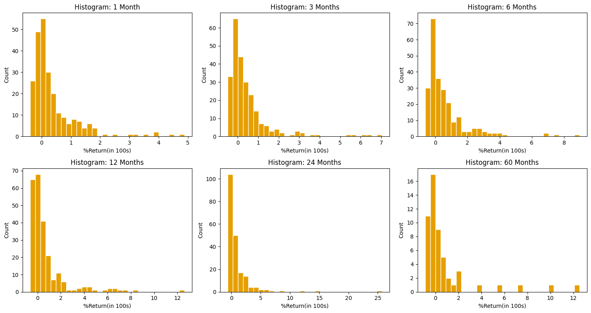
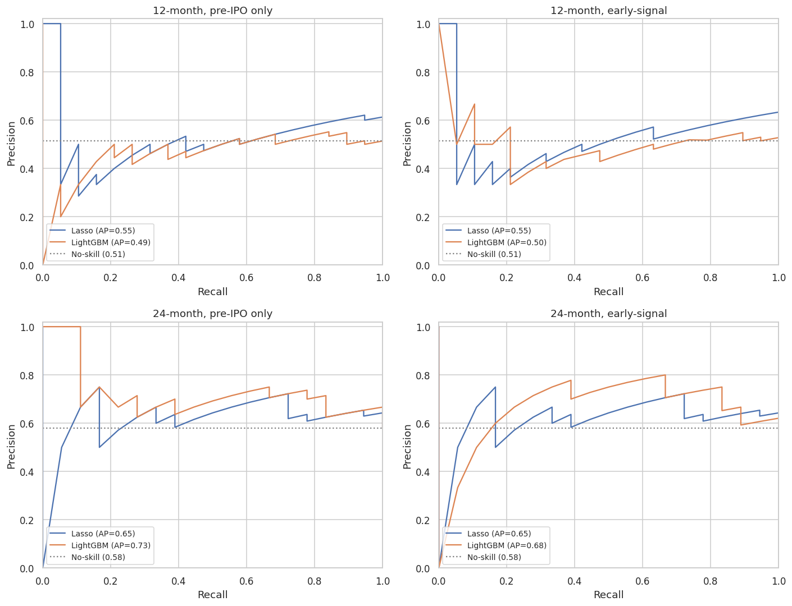

# How to Approach IPOs: Stock Performance Prediction of IPOs in the Turkish Stock Market 

## Overview

This project analyzes 247 BIST IPOs from 2013–2025 to find which factors predict post-IPO stock performance. It models 12-month and 24-month returns using hypothesis testing and machine learning.

## Motivation

Investing and especially starting early is key for financial safety, and my journey started at 18 with IPOs thanks to my friends in high school. Since then, I've been constantly expanding my knowledge on investing, but the habit of IPO investing stuck with me. I've noticed the pattern that during some periods, most new IPOs perform well in the first few weeks, more people start joining them, and then most of them (myself included) sell out after the initial decline. This short term strategy doesn't provide any long term gains, so this project aims to predict which IPOs are worth holding over 12 and 24 months.

## Data Sources & Collection

**1. IPO Stock Data**
- **Source:** Sermaye Piyasası Kurulu (SPK)
- **Method:** Downloaded official Excel files
- **Period:** 2013–2025
- **Features:** company name and ticker, free float ratio (halka açıklık oranı), stock price at IPO, post-IPO nominal capital, underwriter (aracı kurum), first day of trading, oversubscription rate, investor count
- **Preprocessing:** USD-adjusted using the listing-date exchange rate to account for Turkish inflation
- **Links:** [2013–2025 main data](https://spk.gov.tr/ihrac-verileri/ilk-halka-arz-verileri) · [2020–2023 oversubscription data](https://spk.gov.tr/sirketler/duyurular-ve-veriler/ihrac-ve-halka-arz-verileri)

**2. Stock Prices, BIST-100 Index, USD/TRY**
- **Source:** Yahoo Finance
- **Method:** Fetched via the `yfinance` Python package
- **Preprocessing:** Stock prices converted to USD using the daily exchange rate

**3. Company Sector Data**
- **Source:** [Kamuyu Aydınlatma Platformu (KAP)](https://kap.org.tr/tr/Sektorler)
- **Method:** Downloaded the official sector classification file

**4. Derived Features**
- **Market Cap:** post-IPO nominal capital × stock price at IPO (then USD-adjusted)
- **Free Float Value:** free float ratio × market cap
- **BIST-100 Momentum:** percentage distance from the 200-day SMA at the listing date
- **Tavan Days:** consecutive +10% gain days immediately after listing

## Data Preparation

The 13 yearly SPK Excel files (2013–2025) were concatenated into `ipo_main_cleaned.csv` (247 IPOs). The 4 oversubscription Excels (2020–2023) were concatenated into `ipo_overs_cleaned.csv` (117 IPOs).

The KAP sector classification file was parsed (each sector row is followed by its member-company rows) and merged onto the main dataset by ticker. Several tickers had been renamed since their IPO (e.g. EFORC → EFOR) or delisted (e.g. AKPAZ, VIAGO) — these were fixed manually so that every IPO has a sector.

The main file was then enriched in `Data_Analysis.ipynb` with stock-price-derived features (returns at 1/3/6/12/24/60 months in both TRY and USD, BIST-100 momentum at the listing date, tavan days, market cap in USD) and saved as `ipo_final.csv`, which is the file the ML stage uses.

## Data Analysis Methods

### EDA

- Distribution of USD returns across six horizons (1m, 3m, 6m, 12m, 24m, 60m)
- Distributions of key features: free float ratio, market cap
- IPO volume by year (2013–2025)
- Average 12-month USD return per listing year
- BIST-100 momentum (distance from 200-day SMA) at every IPO listing date


 
### Hypotheses and Test Results

Each hypothesis was tested at α = 0.05 using 12-month USD returns, except hypothesis 8 which uses 24-month returns. The oversubscription hypothesis is limited to 2020–2023 since older data lacks that feature.

| # | Hypothesis | Test | Statistic | p-value | Decision |
|---|---|---|---|---|---|
| 1 | Lower free float ratio → higher returns | Spearman | 0.0376 | 0.5634 | Fail to reject |
| 2 | Underwriter identity affects returns | Kruskal-Wallis | 30.2935 | 0.0070 | **Reject** |
| 3 | Higher oversubscription → higher returns | Spearman | 0.1335 | 0.1512 | Fail to reject |
| 4 | REIT (GYO) sector underperforms | Mann-Whitney U | 1802.0 | 0.0078 | **Reject** |
| 5 | High BIST-100 momentum at listing → higher returns | Mann-Whitney U | 2972.0 | 0.6779 | Fail to reject |
| 6 | Lower market cap → higher returns | Spearman | −0.2813 | <0.001 | **Reject** |
| 7 | Lower free-float value → higher returns | Spearman | −0.3051 | <0.001 | **Reject** |
| 8 | More tavan days → higher 24m returns | Spearman | 0.2434 | <0.001 | **Reject** |

## Machine Learning

Binary classifiers were trained to predict whether an IPO had a positive USD return at 12 and 24 months. Each was trained twice — once on **pre-IPO features only** (known at offering time) and once with an **early-signal variant** that adds `tavan_days` (consecutive +10% days right after listing).

Three models were compared: a **Dummy** baseline (no-skill floor), **Lasso** L1 logistic regression with cross-validated regularization, and **LightGBM** with a small grid search over learning rate, leaf count, and tree depth.

The data was split 70/15/15 in time order (oldest → newest) so the test set is the most recent IPOs — a more honest forward test than a random split. **Average Precision (AP)** is the main metric, chosen because the classes aren't perfectly balanced (~57/43 at 12m).

**Results (test set Average Precision):**

| Horizon | Features | Dummy | Lasso | LightGBM |
|---|---|---|---|---|
| 12m | pre-IPO | 0.514 | 0.548 | 0.488 |
| 12m | early-signal | 0.514 | 0.550 | 0.502 |
| 24m | pre-IPO | 0.581 | 0.647 | **0.733** |
| 24m | early-signal | 0.581 | 0.647 | 0.682 |

The bolded value is the best overall result.



## Key Findings

**From EDA and hypothesis testing:**

1. **Small companies outperform.** Low market cap and low free-float value are the two strongest indicators of strong 12-month returns (Spearman ρ = -0.28 and -0.31 respectively, both p < 0.001).

2. **Underwriter identity matters.** Some underwriters consistently outperform others (Kruskal-Wallis p = 0.007), likely because they tend to take smaller-cap companies public.

3. **REITs underperform.** GYO-sector IPOs returned less than the rest of the market over 12 months (Mann-Whitney U test, p = 0.008).

4. **Early ceiling days predict long-term outcomes.** IPOs with more consecutive +10% days after listing tend to have better 24-month returns (ρ = 0.24, p < 0.001).

**From ML modeling:**

1. **24-month classification is meaningfully predictable.** The best model (LightGBM on pre-IPO features) reaches AP = 0.733 against a no-skill baseline of 0.581 — a +0.15 improvement.

2. **12-month classification is much weaker** (Lasso AP = 0.548 vs baseline 0.514), suggesting short-term IPO returns are dominated by trading dynamics that pre-IPO features can't capture.

3. **ML and EDA agree on what matters.** The features Lasso kept (underwriter, free-float value, GYO sector, BIST momentum) are the same ones the hypothesis tests flagged as significant.

4. **Most of the signal is already present at the offering.** The early-signal variant (adding `tavan_days`) performs comparably to pre-IPO-only, suggesting post-listing trading information doesn't add much predictive value beyond what's known at IPO.

## Limitations and Future Work

**Limitations:**

- **Small dataset.** Only 247 IPOs, of which 167 ended up in the training set for the 12m classifier and 141 for the 24m classifier. Test AP numbers can be noisy and small gains over the baseline shouldn't be over-interpreted.

- **Test set covers a narrow window.** The 15% most recent IPOs with observable returns at the relevant horizon — roughly April 2024 to February 2025 for the 12m classifier, and September 2023 to April 2024 for the 24m classifier. If the market regime in those test periods is meaningfully different from earlier years, test performance could underestimate or overestimate how well the model would do going forward.

- **Excluded features.** `listing_year` and `usdtry_at_listing` both monotonically increase over time, so test values lie outside the training range and the model can't generalize on them. Oversubscription rate and investor count were excluded because they're only available for 2020–2023 IPOs, which doesn't cover the test set.

- **Survivorship bias.** Companies that were delisted after their IPO don't have price data available via Yahoo Finance, so they were dropped from the dataset. The sample over-represents IPOs that survived, which may bias predictions toward more favorable outcomes.

- **Regression didn't work.** Continuous return regression was attempted but produced R² near zero at this sample size, so the project focused on classification.

**Future Work:**

- **Institutional vs retail allocation.** Incorporate the institutional/retail demand split (available in SPK oversubscription data for 2020–2023). May carry information beyond raw oversubscription rate.

- **Excess return vs BIST-100.** Predict whether an IPO beat the index instead of the absolute USD return. Removes macro tailwind/headwind.

- **Macroeconomic features.** Add features known at listing time that take values in the test range (central bank rate, inflation expectations, BIST-100's recent performance), unlike `listing_year`.

- **Prospectus-derived features.** Extract use-of-proceeds, lock-up period length, and similar company-specific signals from the IPO prospectus (izahname).

- **Longer horizons.** Explore 36m and 60m returns if more historical data becomes available. Long-term returns are more tied to company fundamentals that pre-IPO features can capture.

- **Magnitude regression.** A separate model predicting *how much* the return is, not just whether it's positive, with a more detailed feature set.

- **Nested cross-validation** for more robust performance estimation given the small validation set.

## Setup and Reproducibility

### Requirements
- Python 3.11+
- Dependencies listed in `requirements.txt`
- Internet connection (only required when running `Data_Analysis.ipynb`, which fetches stock prices via yfinance)

### Installation

```bash
git clone https://github.com/onurerdem8/DSA210_Project.git
cd DSA210_Project
pip install -r requirements.txt
```

### Running the Project

The notebooks are designed to be run in Google Colab. Since they reference files by their bare filenames (e.g., `pd.read_csv("ipo_final.csv")`), the relevant files must be uploaded to the Colab session's working directory before running each notebook.

**Most users will only want to reproduce the ML results — skip to Step 3.**

#### Step 1 (optional): Data Preparation

Reproduces the cleaned CSVs from the raw SPK Excel files. The outputs are already in `data/processed/` so this step is only needed if you want to verify the cleaning pipeline.

Upload all files from `data/raw/SPK IPO Data/` into the Colab session:
- `SPK_IPOs_2013.xlsx` through `SPK_IPOs_2025.xlsx` (13 files)
- `SPK_IPOs_Overs_2020.xlsx` through `SPK_IPOs_Overs_2023.xlsx` (4 files)
- `KAP_Sectors.xlsx`

Then run `Notebooks/Data Preparation/Data_Preparation.ipynb`. Output: `ipo_main_cleaned.csv` and `ipo_overs_cleaned.csv`.

#### Step 2 (optional): Data Analysis, EDA, and Hypothesis Testing

Produces `ipo_final.csv` (the dataset used by the ML notebook) and runs the EDA and hypothesis tests. Requires internet — uses yfinance to pull stock prices, BIST-100, and USD/TRY history. Note that re-running may produce minor numerical differences from the committed `ipo_final.csv` because Yahoo Finance can update historical data.

Upload from `data/processed/`:
- `ipo_main_cleaned.csv`
- `ipo_overs_cleaned.csv`

Then run `Notebooks/Visualization, EDA and Hypothesis Testing/Data_Analysis.ipynb`. Output: `ipo_final.csv` (in the Colab session), plus inline plots and hypothesis test results.

#### Step 3: Machine Learning

The minimum needed to reproduce the ML results. No internet required, fully deterministic given `RNG=42`.

Upload from `data/processed/`:
- `ipo_final.csv`

Then run `Notebooks/Machine Learning/Machine_Learning.ipynb`. Outputs printed inline: AP comparison table, PR curves, final model test evaluation.

### Project Structure

```
DSA210_Project/
├── README.md
├── Proposal.pdf
├── requirements.txt
├── data/
│   ├── raw/SPK IPO Data/   # original SPK Excel files + KAP sectors file
│   └── processed/          # cleaned and merged CSVs (ipo_main_cleaned.csv,
│                           # ipo_overs_cleaned.csv, ipo_final.csv)
└── Notebooks/
    ├── Data Preparation/Data_Preparation.ipynb
    ├── Visualization, EDA and Hypothesis Testing/Data_Analysis.ipynb
    └── Machine Learning/Machine_Learning.ipynb
```

## AI Usage

**AI tools (Claude, Gemini) were used for:**
- Merging tables, data cleaning, and feature generation during data preparation
- Learning Python syntax for visualization, EDA, and hypothesis testing
- Structuring the ML pipeline, cleaning the underwriter column, and explaining methodology choices

All data collection, hypothesis formulation, modeling decisions (feature selection, target definitions, underwriter handling), and interpretations were made by the author.
